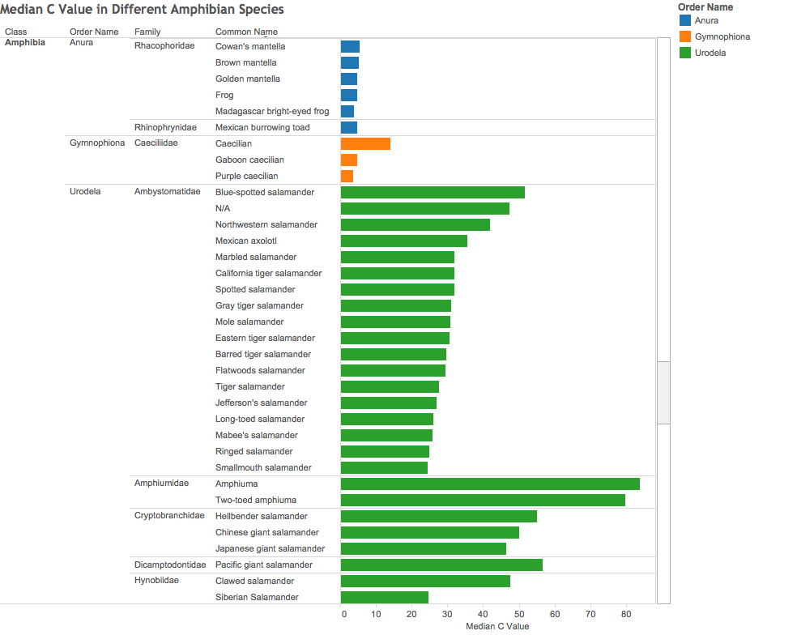

## DV_FinalProject
========================================================
#### Group member: Anna Mengjie Yu (my3852),  Duy Vu (dhv242),  Syed Naqvi (san724)

In this project, we visualized genomic data from 3 different data sources. 

In the first part, we visualized the status of current genome sequencing project and forecast the near future (5 years) in Tableau. We also visualized the cost of genome sequencing in the past decade in Tableau. The workbooks in named NumOfGenomeSequenced.twb. and GenomeCost.twb, respectively.

In the second part, we visualized the animal genome size in Tableau, the data is downloaded from Animal Genome Size Database. And the workbooks are named GenomeSize.twb and Union.twb.

In the last part, we visualized diatom plastid genome data in R. The tables contain plastid genome gene content, gene length and gene order, and they are accessible from Supporting Information in Yu's publicaiton. [http://journals.plos.org/plosone/article?id=10.1371/journal.pone.0107854]

*********
Load packages

```{r}
source("../01 Data/loadPackage.R", echo = TRUE)
```

*********
**Data Visualization Part 1**

*********
**Part 1 Data Source:** 


*********
**Figure 1: Average Salary in Each Department**

Method:


  

*********


*********
**Figure 1: Average Salary in Each Department**

Method:


Calculated field


*********
**Figure 1: Average Salary in Each Department**

Method:


*********
**Figure 1: Average Salary in Each Department**

Method:


*********
**Data Visualization Part 1**
*********
**Part 1 Data Source:** 


*********
**Figure 1: Average Salary in Each Department**

Method:


*********
**Figure 1: Average Salary in Each Department**

Method:


*********
**Figure 1: Average Salary in Each Department**

Method:


*********
**Figure 1: Average Salary in Each Department**

Method:


*********
**Figure 1: Average Salary in Each Department**

Method:




*********
**Figure 1: Average Salary in Each Department**

Method:


*********
**Figure 1: Average Salary in Each Department**

Method:


*********
**Figure 1: Average Salary in Each Department**

Method:


*********
**Data Visualization Part 3**

*********
**Part 1 Data Source:** 


*********
Load packages

```{r}
source("../01 Data/loadPackage.R", echo = TRUE)
```

*********
First, we displayed a few lines of the dataset stored in oracle database. The table includes Name(gene name), MINIMUM (gene start position), MAXIMUM(gene end position), LENGTH(gene length), DIRECTION(sense and anti-sense strand).


**Table 1: Cyclotella**
```{r}
source("../01 Data/Diatoms.R", echo = TRUE)
```


*********
**Data Wrangling**
 
 1.For each original table, create new column gene_family by extracting the first three charaters from gene NAME, and further group by gene family.
```{r}
source("../02 Data Wrangling/Diatoms_geneFamily.R", echo = TRUE)
```
 *********
 2. We calculated the average gene length in each gene family using T.oceanica data set.
 ```{r}
source("../02 Data Wrangling/Ocean_gf_len.R", echo = TRUE)
```
**********
**Data Visualization**
 


```{r}
source("../03 Visualizations/Ocean_gf_len.R", echo = TRUE)
```

```{r}
source("../03 Visualizations/Ocean_gf_cnt.R", echo = TRUE)
```

```{r}
source("../03 Visualizations/FiveDiatoms.R", echo = TRUE)
```