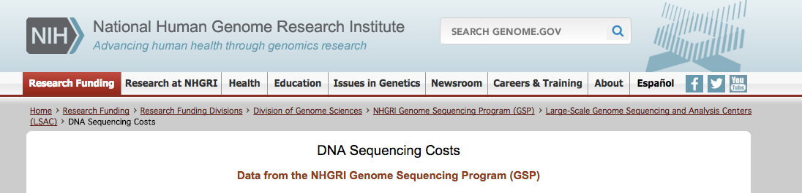
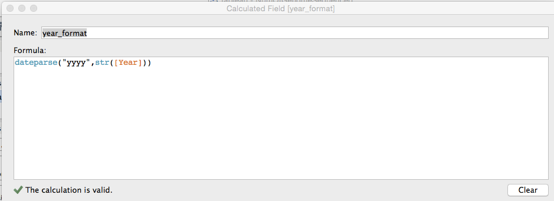
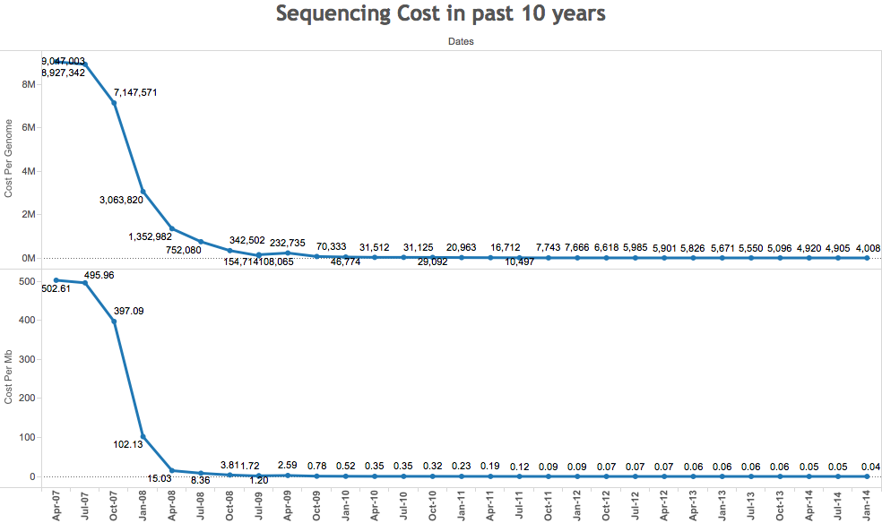
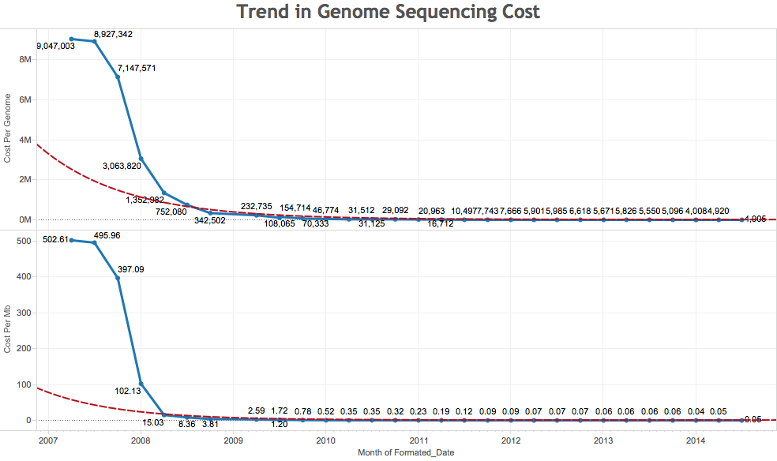
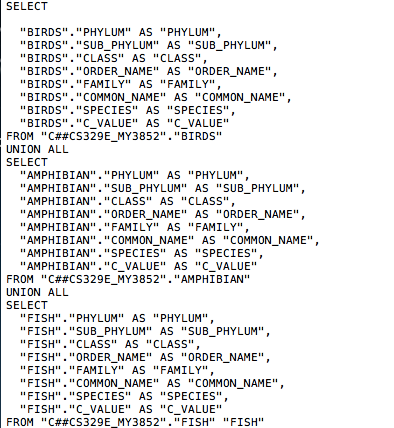

## DV_FinalProject
========================================================
#### Group member: Anna Mengjie Yu (my3852),  Duy Vu (dhv242),  Syed Naqvi (san724)

In this project, we visualized genomic data from 3 different data sources. 

In the first part, we visualized the status of current genome sequencing project and forecast the near future (5 years) in Tableau. We also visualized the cost of genome sequencing in the past decade in Tableau. The workbooks in named NumOfGenomeSequenced.twb. and GenomeCost.twb, respectively.

In the second part, we visualized the animal genome size in Tableau, the data is downloaded from Animal Genome Size Database. And the workbooks are named GenomeSize.twb and Union.twb.

In the last part, we visualized diatom plastid genome data in R. The tables contain plastid genome gene content, gene length and gene order, and they are accessible from Supporting Information in Yu's publicaiton. [http://journals.plos.org/plosone/article?id=10.1371/journal.pone.0107854]

*********
Load packages


```r
source("../01 Data/loadPackage.R", echo = TRUE)
```

```
## 
## > require("ggplot2")
```

```
## Loading required package: ggplot2
```

```
## 
## > require("gplots")
```

```
## Loading required package: gplots
## 
## Attaching package: 'gplots'
## 
## The following object is masked from 'package:stats':
## 
##     lowess
```

```
## 
## > require("grid")
```

```
## Loading required package: grid
```

```
## 
## > require("RCurl")
```

```
## Loading required package: RCurl
## Loading required package: bitops
```

```
## 
## > require("reshape2")
```

```
## Loading required package: reshape2
```

```
## 
## > require("tidyr")
```

```
## Loading required package: tidyr
```

```
## 
## > require("dplyr")
```

```
## Loading required package: dplyr
## 
## Attaching package: 'dplyr'
## 
## The following object is masked from 'package:stats':
## 
##     filter
## 
## The following objects are masked from 'package:base':
## 
##     intersect, setdiff, setequal, union
```

```
## 
## > require("jsonlite")
```

```
## Loading required package: jsonlite
## 
## Attaching package: 'jsonlite'
## 
## The following object is masked from 'package:utils':
## 
##     View
```

*********
**Data Visualization Part 1**

*********
**Part 1 Data Source:** 


*********
**Figure 1: Average Salary in Each Department**

Method:


  

*********


*********
**Figure 1: Average Salary in Each Department**

Method:


Calculated field


*********
**Figure 1: Average Salary in Each Department**

Method:




*********
**Figure 1: Average Salary in Each Department**

Method:




*********
**Data Visualization Part 1**
*********
**Part 1 Data Source:** 


*********
**Figure 1: Average Salary in Each Department**

Method:


*********
**Figure 1: Average Salary in Each Department**

Method:


*********
**Figure 1: Average Salary in Each Department**

Method:


*********
**Figure 1: Average Salary in Each Department**

Method:


*********
**Figure 1: Average Salary in Each Department**

Method:


*********
**Figure 1: Average Salary in Each Department**

Method:




*********
**Figure 1: Average Salary in Each Department**

Method:


*********
**Figure 1: Average Salary in Each Department**

Method:


*********
**Data Visualization Part 3**

*********
**Part 1 Data Source:** 


*********
Load packages


```r
source("../01 Data/loadPackage.R", echo = TRUE)
```

```
## 
## > require("ggplot2")
## 
## > require("gplots")
## 
## > require("grid")
## 
## > require("RCurl")
## 
## > require("reshape2")
## 
## > require("tidyr")
## 
## > require("dplyr")
## 
## > require("jsonlite")
```

*********
First, we displayed a few lines of the dataset stored in oracle database. The table includes Name(gene name), MINIMUM (gene start position), MAXIMUM(gene end position), LENGTH(gene length), DIRECTION(sense and anti-sense strand).


**Table 1: Cyclotella**

```r
source("../01 Data/Diatoms.R", echo = TRUE)
```

```
## 
## > cyclotella <- data.frame(eval(parse(text = substring(getURL(URLencode("http://129.152.144.84:5001/rest/native/?query=\"select * from cyclotella\""), .... [TRUNCATED] 
## 
## > cyclotella %>% tbl_df
## Source: local data frame [180 x 5]
## 
##              NAME MINIMUM MAXIMUM LENGTH DIRECTION
## 1       psaA gene     103   2,361  2,259   forward
## 2       psaB gene   2,478   4,679  2,202   forward
## 3       petF gene   4,912   5,244    333   reverse
## 4      rpl20 gene   5,425   5,844    420   reverse
## 5      rpl35 gene   5,854   6,048    195   reverse
## 6      ycf42 gene   6,055   6,690    636   reverse
## 7       psaE gene   6,792   6,989    198   reverse
## 8  trnR(ucu) gene   7,154   7,226     73   reverse
## 9  trnV(uac) gene   7,237   7,308     72   reverse
## 10      psbH gene   7,575   7,775    201   reverse
## ..            ...     ...     ...    ...       ...
## 
## > cera <- data.frame(fromJSON(getURL(URLencode("129.152.144.84:5001/rest/native/?query=\"select * from cerataulina\""), 
## +     httpheader = c(DB = "jd ..." ... [TRUNCATED] 
## 
## > cera %>% tbl_df
## Source: local data frame [169 x 5]
## 
##             NAME MINIMUM MAXIMUM LENGTH DIRECTION
## 1      psaA gene     362   2,620  2,259   forward
## 2      psaB gene   2,712   4,913  2,202   forward
## 3  trnD-GUC gene   5,037   5,110     74   reverse
## 4  trnS-GCU gene   5,175   5,260     86   reverse
## 5  trnI-CAU gene   5,298   5,369     72   reverse
## 6     ycf33 gene   5,546   5,740    195   forward
## 7  trnY-GUA gene   7,698   7,780     83   reverse
## 8  trnV-UAC gene   8,306   8,371     66   forward
## 9  trnR-UCU gene   8,383   8,455     73   forward
## 10     trnT(ugu)   8,768   8,839     72   reverse
## ..           ...     ...     ...    ...       ...
## 
## > chaeto <- data.frame(fromJSON(getURL(URLencode("129.152.144.84:5001/rest/native/?query=\"select * from chaetoceros\""), 
## +     httpheader = c(DB = " ..." ... [TRUNCATED] 
## 
## > chaeto %>% tbl_df
## Source: local data frame [169 x 5]
## 
##              NAME MINIMUM MAXIMUM LENGTH DIRECTION
## 1      ycf45 gene       2   1,168  1,167   reverse
## 2       petD gene   1,330   1,812    483   reverse
## 3       petB gene   1,865   2,512    648   reverse
## 4   trnS-UGA gene   2,571   2,657     87   reverse
## 5       psaD gene   2,690   3,109    420   reverse
## 6  trnfM-CAU gene   3,195   3,266     72   reverse
## 7       rps2 gene   3,388   4,071    684   reverse
## 8      rpoC2 gene   4,159   8,406  4,248   reverse
## 9      rpoC1 gene   8,435  10,840  2,406   reverse
## 10      rpoB gene  10,858  15,099  4,242   reverse
## ..            ...     ...     ...    ...       ...
## 
## > ocean <- data.frame(fromJSON(getURL(URLencode("129.152.144.84:5001/rest/native/?query=\"select * from ocean\""), 
## +     httpheader = c(DB = "jdbc:or ..." ... [TRUNCATED] 
## 
## > ocean %>% tbl_df
## Source: local data frame [185 x 5]
## 
##           NAME START_POS END_POS LENGTH DIRECTION
## 1     psaA CDS       122    2380   2259   forward
## 2     psaB CDS      2484    4685   2202   forward
## 3    trnV tRNA      5389    5460     72   forward
## 4  trnR-2 tRNA      5480    5552     73   forward
## 5   orf127 CDS      6165    6587    423   reverse
## 6    rpl19 CDS      7142    7504    363   reverse
## 7  trnM-2 tRNA      7591    7675     85   reverse
## 8   ssra tmRNA      7680    8013    334   reverse
## 9  trnR-1 tRNA      8072    8144     73   reverse
## 10    atpA CDS      9008   10519   1512   reverse
## ..         ...       ...     ...    ...       ...
## 
## > weiss <- data.frame(fromJSON(getURL(URLencode("129.152.144.84:5001/rest/native/?query=\"select * from weiss\""), 
## +     httpheader = c(DB = "jdbc:or ..." ... [TRUNCATED] 
## 
## > weiss %>% tbl_df
## Source: local data frame [180 x 5]
## 
##              NAME MINIMUM MAXIMUM LENGTH DIRECTION
## 1      rpl32 gene 120,353 120,517    165   reverse
## 2       psbY gene 120,762 120,872    111   reverse
## 3       rrn5 rRNA 121,057 121,182    126   reverse
## 4             rns 121,332 124,090  2,759   reverse
## 5   trnA-UGC gene 124,179 124,251     73   reverse
## 6   trnI-GAU gene 124,254 124,327     74   reverse
## 7             rnl 124,384 125,860  1,477   reverse
## 8      ycf89 gene 126,149 127,111    963   reverse
## 9  trnP(ugg) gene 127,458 127,531     74   forward
## 10      psaA gene     142   2,400  2,259   forward
## ..            ...     ...     ...    ...       ...
```


*********
**Data Wrangling**
 
 1.For each original table, create new column gene_family by extracting the first three charaters from gene NAME, and further group by gene family.

```r
source("../02 Data Wrangling/Diatoms_geneFamily.R", echo = TRUE)
```

```
## 
## > cyc_gf <- cyclotella %>% mutate(gene_family = substr(NAME, 
## +     1, 3)) %>% group_by(gene_family)
## 
## > cyc_gf %>% tbl_df
## Source: local data frame [180 x 6]
## 
##              NAME MINIMUM MAXIMUM LENGTH DIRECTION gene_family
## 1       psaA gene     103   2,361  2,259   forward         psa
## 2       psaB gene   2,478   4,679  2,202   forward         psa
## 3       petF gene   4,912   5,244    333   reverse         pet
## 4      rpl20 gene   5,425   5,844    420   reverse         rpl
## 5      rpl35 gene   5,854   6,048    195   reverse         rpl
## 6      ycf42 gene   6,055   6,690    636   reverse         ycf
## 7       psaE gene   6,792   6,989    198   reverse         psa
## 8  trnR(ucu) gene   7,154   7,226     73   reverse         trn
## 9  trnV(uac) gene   7,237   7,308     72   reverse         trn
## 10      psbH gene   7,575   7,775    201   reverse         psb
## ..            ...     ...     ...    ...       ...         ...
## 
## > weiss_gf <- weiss %>% mutate(gene_family = substr(NAME, 
## +     1, 3)) %>% group_by(gene_family)
## 
## > weiss_gf %>% tbl_df
## Source: local data frame [180 x 6]
## 
##              NAME MINIMUM MAXIMUM LENGTH DIRECTION gene_family
## 1      rpl32 gene 120,353 120,517    165   reverse         rpl
## 2       psbY gene 120,762 120,872    111   reverse         psb
## 3       rrn5 rRNA 121,057 121,182    126   reverse         rrn
## 4             rns 121,332 124,090  2,759   reverse         rns
## 5   trnA-UGC gene 124,179 124,251     73   reverse         trn
## 6   trnI-GAU gene 124,254 124,327     74   reverse         trn
## 7             rnl 124,384 125,860  1,477   reverse         rnl
## 8      ycf89 gene 126,149 127,111    963   reverse         ycf
## 9  trnP(ugg) gene 127,458 127,531     74   forward         trn
## 10      psaA gene     142   2,400  2,259   forward         psa
## ..            ...     ...     ...    ...       ...         ...
## 
## > cera_gf <- cera %>% mutate(gene_family = substr(NAME, 
## +     1, 3)) %>% group_by(gene_family)
## 
## > cera_gf %>% tbl_df
## Source: local data frame [169 x 6]
## 
##             NAME MINIMUM MAXIMUM LENGTH DIRECTION gene_family
## 1      psaA gene     362   2,620  2,259   forward         psa
## 2      psaB gene   2,712   4,913  2,202   forward         psa
## 3  trnD-GUC gene   5,037   5,110     74   reverse         trn
## 4  trnS-GCU gene   5,175   5,260     86   reverse         trn
## 5  trnI-CAU gene   5,298   5,369     72   reverse         trn
## 6     ycf33 gene   5,546   5,740    195   forward         ycf
## 7  trnY-GUA gene   7,698   7,780     83   reverse         trn
## 8  trnV-UAC gene   8,306   8,371     66   forward         trn
## 9  trnR-UCU gene   8,383   8,455     73   forward         trn
## 10     trnT(ugu)   8,768   8,839     72   reverse         trn
## ..           ...     ...     ...    ...       ...         ...
## 
## > chaeto_gf <- chaeto %>% mutate(gene_family = substr(NAME, 
## +     1, 3)) %>% group_by(gene_family)
## 
## > chaeto_gf %>% tbl_df
## Source: local data frame [169 x 6]
## 
##              NAME MINIMUM MAXIMUM LENGTH DIRECTION gene_family
## 1      ycf45 gene       2   1,168  1,167   reverse         ycf
## 2       petD gene   1,330   1,812    483   reverse         pet
## 3       petB gene   1,865   2,512    648   reverse         pet
## 4   trnS-UGA gene   2,571   2,657     87   reverse         trn
## 5       psaD gene   2,690   3,109    420   reverse         psa
## 6  trnfM-CAU gene   3,195   3,266     72   reverse         trn
## 7       rps2 gene   3,388   4,071    684   reverse         rps
## 8      rpoC2 gene   4,159   8,406  4,248   reverse         rpo
## 9      rpoC1 gene   8,435  10,840  2,406   reverse         rpo
## 10      rpoB gene  10,858  15,099  4,242   reverse         rpo
## ..            ...     ...     ...    ...       ...         ...
## 
## > ocean_gf <- ocean %>% mutate(gene_family = substr(NAME, 
## +     1, 3)) %>% group_by(gene_family)
## 
## > ocean_gf %>% tbl_df
## Source: local data frame [185 x 6]
## 
##           NAME START_POS END_POS LENGTH DIRECTION gene_family
## 1     psaA CDS       122    2380   2259   forward         psa
## 2     psaB CDS      2484    4685   2202   forward         psa
## 3    trnV tRNA      5389    5460     72   forward         trn
## 4  trnR-2 tRNA      5480    5552     73   forward         trn
## 5   orf127 CDS      6165    6587    423   reverse         orf
## 6    rpl19 CDS      7142    7504    363   reverse         rpl
## 7  trnM-2 tRNA      7591    7675     85   reverse         trn
## 8   ssra tmRNA      7680    8013    334   reverse         ssr
## 9  trnR-1 tRNA      8072    8144     73   reverse         trn
## 10    atpA CDS      9008   10519   1512   reverse         atp
## ..         ...       ...     ...    ...       ...         ...
```
 *********
 2. We calculated the average gene length in each gene family using T.oceanica data set.
 
 ```r
 source("../02 Data Wrangling/Ocean_gf_len.R", echo = TRUE)
 ```
 
 ```
 ## 
 ## > ocean_gf_len <- ocean_gf %>% group_by(gene_family) %>% 
 ## +     summarise(avg_gene_length = mean(LENGTH))
 ## 
 ## > ocean_gf_len %>% tbl_df
 ## Source: local data frame [29 x 2]
 ## 
 ##    gene_family avg_gene_length
 ## 1          atp           736.5
 ## 2          cbb           864.0
 ## 3          ccs          1122.0
 ## 4          chl          1059.0
 ## 5          clp          2799.0
 ## 6          dna          1596.0
 ## 7          ffs           100.0
 ## 8          flr            75.0
 ## 9          fts          1929.0
 ## 10         gro          1593.0
 ## ..         ...             ...
 ```
**********
**Data Visualization**
 


```r
source("../03 Visualizations/Ocean_gf_len.R", echo = TRUE)
```

```
## 
## > ggplot(ocean_gf_len, aes(y = avg_gene_length, x = gene_family, 
## +     group = 1)) + stat_smooth(se = TRUE, size = 2, method = loess) + 
## +     geom_p .... [TRUNCATED]
```

 


```r
source("../03 Visualizations/Ocean_gf_cnt.R", echo = TRUE)
```

```
## 
## > ocean_g <- ggplot(data = ocean_gf, mapping = aes(x = gene_family)) + 
## +     layer(geom = "bar", mapping = aes(fill = DIRECTION)) + labs(title = "Tha ..." ... [TRUNCATED] 
## 
## > ocean_g
```

 


```r
source("../03 Visualizations/FiveDiatoms.R", echo = TRUE)
```

```
## 
## > l_gf <- list()
## 
## > ocean_g <- ggplot(data = ocean_gf, mapping = aes(x = gene_family)) + 
## +     layer(geom = "bar", mapping = aes(fill = DIRECTION)) + labs(title = "Tha ..." ... [TRUNCATED] 
## 
## > ocean_g
```

 

```
## 
## > l_gf[[1]] <- ggplot(data = cyc_gf, mapping = aes(x = gene_family)) + 
## +     layer(geom = "bar", mapping = aes(fill = DIRECTION)) + labs(title = "Cyc ..." ... [TRUNCATED] 
## 
## > l_gf[[2]] <- ggplot(data = weiss_gf, mapping = aes(x = gene_family)) + 
## +     layer(geom = "bar", mapping = aes(fill = DIRECTION)) + labs(title = "T ..." ... [TRUNCATED] 
## 
## > l_gf[[3]] <- ggplot(data = cera_gf, mapping = aes(x = gene_family)) + 
## +     layer(geom = "bar", mapping = aes(fill = DIRECTION)) + labs(title = "Ce ..." ... [TRUNCATED] 
## 
## > l_gf[[4]] <- ggplot(data = chaeto_gf, mapping = aes(x = gene_family)) + 
## +     layer(geom = "bar", mapping = aes(fill = DIRECTION)) + labs(title = " ..." ... [TRUNCATED] 
## 
## > pushViewport(viewport(layout = grid.layout(2, 4)))
## 
## > print(l_gf[[1]], vp = viewport(layout.pos.row = 1, 
## +     layout.pos.col = 1:2))
## 
## > print(l_gf[[2]], vp = viewport(layout.pos.row = 1, 
## +     layout.pos.col = 3:4))
## 
## > print(l_gf[[3]], vp = viewport(layout.pos.row = 2, 
## +     layout.pos.col = 1:2))
## 
## > print(l_gf[[4]], vp = viewport(layout.pos.row = 2, 
## +     layout.pos.col = 3:4))
```
